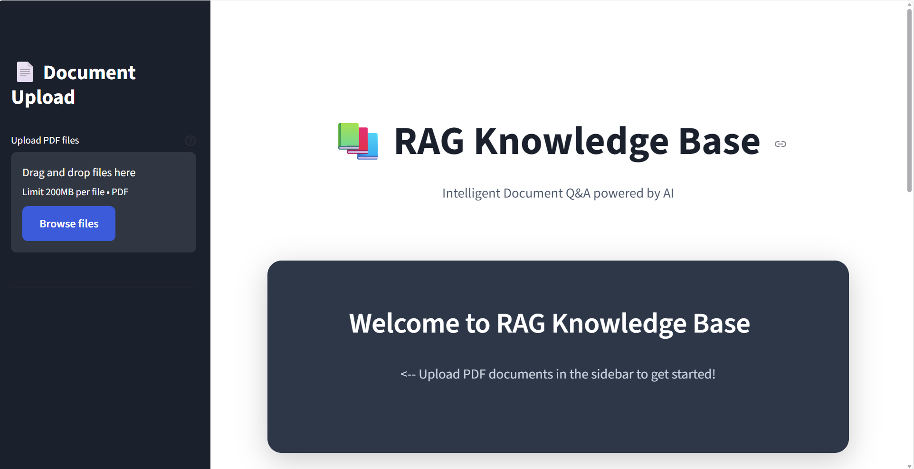
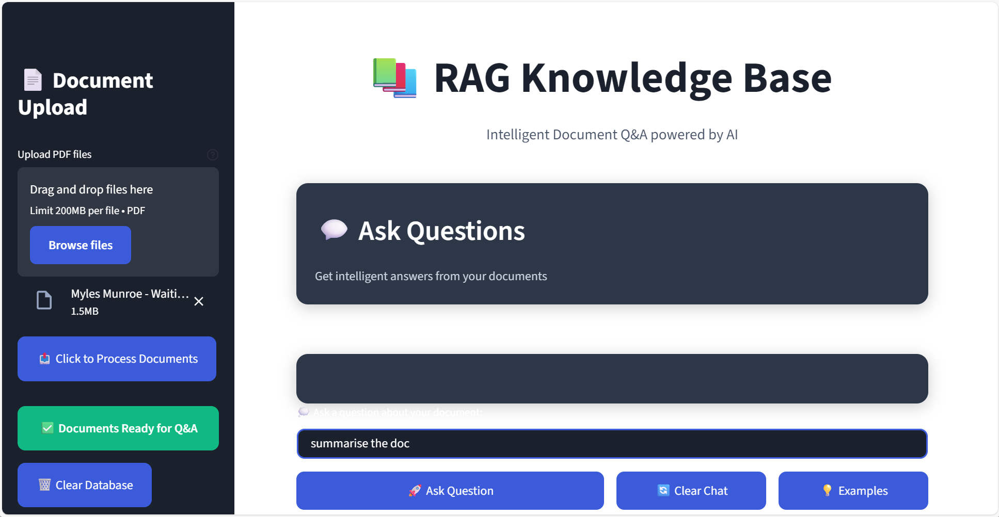
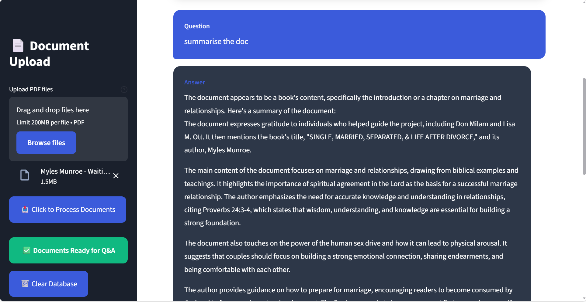

# RAG Knowledge Base

An intelligent document Q&A chatbot that lets you upload PDFs and ask questions about their content. Built with Streamlit, LangChain, and Groq's free LLM API.

## Features

- Upload and process multiple PDF documents
- Ask natural language questions about your documents
- Get AI-generated answers with source citations
- Privacy-focused: embeddings run locally, only queries are sent to the API
- Clean, modern dark theme UI

## Screenshots





## Quick Start

### Installation

```bash
pip install -r requirements.txt
```

### Setup

1. Get a free API key from [console.groq.com](https://console.groq.com) (no credit card required)

2. Create a `.env` file in the project root:
```
GROQ_API_KEY=your_api_key_here
```

3. Run the app:
```bash
streamlit run streamlit_app.py
```

The app will open at `http://localhost:8501`

## Usage

1. **Upload Documents**: Use the sidebar to upload one or more PDF files
2. **Process**: Click "Click to Process Documents" to index your files
3. **Ask Questions**: Type your question in the input field and click "Ask Question"
4. **View Sources**: Expand the sources section to see which parts of your documents were used

## Tech Stack

- **Frontend**: Streamlit
- **LLM**: Groq API (Llama 3.1 8B Instant)
- **Embeddings**: HuggingFace sentence-transformers (all-MiniLM-L6-v2)
- **Vector Database**: ChromaDB
- **Framework**: LangChain
- **PDF Processing**: PyPDF

## How It Works

The app uses Retrieval-Augmented Generation (RAG):

1. PDFs are split into chunks and converted to vector embeddings
2. When you ask a question, it's also converted to an embedding
3. The system finds the most relevant document chunks using similarity search
4. These chunks are sent to the LLM along with your question
5. The LLM generates an answer based on the retrieved context

## Deployment

### Streamlit Cloud

1. Push your code to GitHub
2. Go to [share.streamlit.io](https://share.streamlit.io)
3. Connect your repository
4. Add your `GROQ_API_KEY` in the Secrets section
5. Deploy

Your users won't need to set up anything - they can just upload documents and start asking questions.

## Troubleshooting

**API Key Error**: Make sure your `.env` file exists and contains the correct key

**Module Not Found**: Run `pip install -r requirements.txt`

**PDF Won't Process**: Ensure the PDF contains actual text (not scanned images)

**Slow First Query**: The embedding model downloads on first use (~80MB). Subsequent queries are fast.

## License

MIT